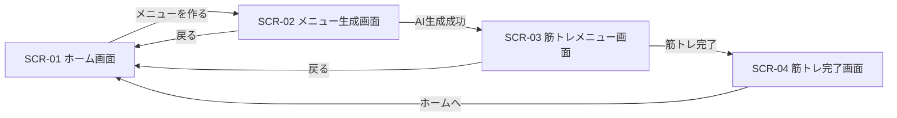
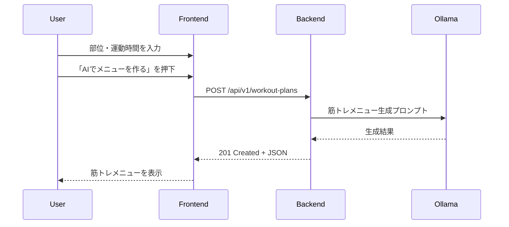
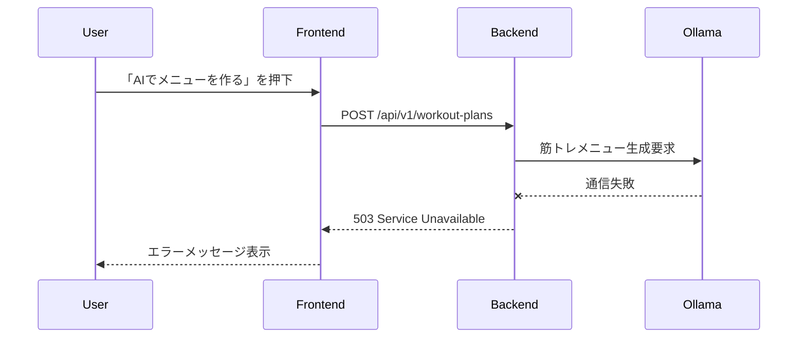

# Webアプリ仕様書

## 1. 概要

テキスト情報（具体的なものが望ましい）を入力として、LLMを用いて、
回答（これも具体的に指定）を表示するアプリ。

## 2. 主な機能

### 2.1 入出力フォーム機能
- テキストエリアでユーザーが質問・指示を入力
- 2.2 生成AIリクエストAPIを実行し、応答を取得する。
- 同一画面上に回答を表示する。

### 2.2 生成AIリクエスト API
- ユーザー入力と定型プロンプトを合成し、LLMに渡すコンテキストを生成
- その際に、適切なコンテキストを追加し、望ましい回答を得られるように情報を付加する。
- OpenRouter経由で各種LLM（例：GPT-4, Claude, Geminiなど）へリクエスト
- 応答をJSON形式でフロントエンドに返す。


## 3. 使用技術

| 分類         | 技術・ライブラリ |
|--------------|------------------|
| フロントエンド | Vue.js / HTML5 + CSS3 |
| バックエンド  | Flask |
| 通信方式     | Fetch API / JSON |
| LLMモデル    | OpenRouter API（OpenAI, Anthropic, Mistral等） |

## 4. 入出力例

### 入力
- ユーザー入力：「竹取物語」

- 付与コンテキスト：あなたは太宰治です。小難しい近代風のしゃべり方をします。

### 出力

- 出力例：月の光が眩しい。眩しすぎて、なんだか吐き気がする。老夫婦が見つけた竹の中から、あの憎らしいほど可愛らしい女の子が出てきたらしい。


# Webアプリ仕様書(小阪案)

## 1. システム名とキャッチコピー

### システム名

**duoMuscle**

### キャッチコピー

**ゲーム感覚で、筋トレを毎日の習慣に。**

---

## 2. ターゲットユーザー（ペルソナ）と解決したい課題（Why）

### ターゲットユーザー

筋トレを始めたい、または一度始めたことはあるが、継続することが苦手な大学生や若者を主なターゲットとする。

### 解決したい課題

筋トレは短期間では成果を実感しにくく、モチベーションを維持することが難しい。そのため、「今日はやらなくてもいい」「明日から再開しよう」と考えてしまい、三日坊主になってしまう人が多い。

そこで、duoMuscleでは、筋トレを単なる運動として管理するのではなく、XPや連続記録、レベルアップなどのゲーム要素を取り入れることで、筋トレを楽しく継続できる環境を提供する。

また、生成AIを利用して、その日の状況に応じたトレーニングメニューや励ましのメッセージを生成し、ユーザーが筋トレを続けやすくすることを目的とする。

---

## 3. As-Is（現状の課題）と To-Be（システム導入後の理想像）

### As-Is（現状）

* 筋トレを始めても、成果をすぐに実感できずモチベーションが低下する。
* 毎回どのようなトレーニングをすればよいか考える必要がある。
* 筋トレを行った記録や継続日数が分かりにくい。
* 一度筋トレを休むと、そのままやめてしまうことがある。
* 筋トレを「やらなければならないもの」と感じ、楽しみながら続けることが難しい。

### To-Be（導入後）

* 毎日の筋トレをゲーム感覚で楽しみながら行うことができる。
* ユーザーの希望に応じて生成AIがトレーニングメニューを提案してくれる。
* 筋トレを行うことでXPを獲得し、レベルアップによって成長を実感できる。
* 連続して筋トレを行った日数を確認でき、継続するモチベーションにつながる。
* 筋トレ終了後にAIから励ましのメッセージを受け取り、次のトレーニングへの意欲を高めることができる。

---

## 4. 主要な機能要件一覧

* ユーザーがその日に行う筋トレメニューを確認できること。
* ユーザーが鍛えたい部位や運動時間などを入力し、生成AIから筋トレメニューの提案を受けることができること。
* ユーザーが実施した筋トレを記録できること。
* 筋トレを完了することでXPを獲得し、レベルや成長状況を確認できること。
* 筋トレを継続した日数を記録し、ストリーク（連続記録）として確認できること。

---

## 5. 非機能要件

* ユーザーが操作してから、通常の画面処理は1秒以内、生成AIによる回答は10秒以内を目安に表示する。
* Google Chromeの最新版で正常に動作すること。
* PCのWebブラウザから利用できること。
* 初めて利用するユーザーでも直感的に操作できる、分かりやすい画面構成とすること。
* ユーザーが入力した内容に対してエラーが発生した場合は、エラーメッセージを表示すること。
* 生成AIとの通信に失敗した場合でも、アプリが停止せず再度操作できること。

# 6. 画面一覧・ワイヤーフレームと状態の定義

## 6.1 画面一覧

| 画面ID | 画面名 | 目的 |
|---|---|---|
| SCR-01 | ホーム画面 | 現在のレベル、XP、ストリーク、今日の筋トレ状況を確認する |
| SCR-02 | メニュー生成画面 | 鍛えたい部位と運動時間を入力し、生成AIに筋トレメニューを作成してもらう |
| SCR-03 | 筋トレメニュー画面 | 生成AIが作成した筋トレメニューを確認し、筋トレを実施する |
| SCR-04 | 筋トレ完了画面 | 筋トレ終了後の獲得XP、レベル、ストリーク、励ましメッセージを確認する |

---

## 6.2 SCR-01 ホーム画面

### 目的

ユーザーが現在の成長状況と、その日の筋トレ状況を確認する。

### 表示項目

- システム名「duoMuscle」
- 現在のレベル
- 現在のXP
- 次のレベルまでに必要なXP
- ストリーク（連続筋トレ日数）
- 今日の筋トレ状況
- 「筋トレメニューを作る」ボタン
- 今日の筋トレメニューが存在する場合は「今日のメニューを見る」ボタン

### ワイヤーフレーム

```text
+--------------------------------------+
|              duoMuscle               |
+--------------------------------------+

              LEVEL 3

            XP 240 / 300
       [██████████████------]

            5日連続！

+--------------------------------------+
| 今日のトレーニング                    |
|                                      |
| まだメニューがありません               |
|                                      |
|    [ 筋トレメニューを作る ]            |
+--------------------------------------+
```

### 状態定義

#### Idle（通常時）

- XP、レベル、ストリークを表示する。
- 今日の筋トレメニューが存在しない場合は「まだメニューがありません」と表示する。
- 今日の筋トレメニューが存在する場合は「今日のメニューを見る」ボタンを表示する。
- ユーザーは各ボタンを操作できる。

#### Loading（処理中）

- ユーザー状態をAPIから取得している間は「読み込み中...」と表示する。
- 二重操作を防止するため、操作ボタンを一時的に非活性にする。

#### Success（成功時）

- APIから取得した現在のXP、レベル、ストリークを表示する。
- 今日の筋トレメニューの有無を画面に反映する。

#### Error（異常時）

ユーザー状態の取得に失敗した場合は、以下のメッセージを表示する。

```text
情報を取得できませんでした。再度お試しください。
```

再度APIへアクセスできるように「再読み込み」ボタンを表示する。

---

## 6.3 SCR-02 メニュー生成画面

### 目的

ユーザーが鍛えたい部位と運動時間を入力し、生成AIから筋トレメニューの提案を受ける。

### 入力項目

| 項目 | 必須 | 内容 |
|---|---|---|
| 鍛えたい部位 | ○ | 胸、腕、背中、肩、腹筋、脚、全身から選択する |
| 運動時間 | ○ | 10分、20分、30分、45分、60分から選択する |

### ワイヤーフレーム

```text
+--------------------------------------+
|        AI筋トレメニュー作成            |
+--------------------------------------+

 鍛えたい部位 *

 [ 胸 ▼ ]


 運動時間 *

 [ 20分 ▼ ]


 [ 戻る ]    [ AIでメニューを作る ]
```

### 状態定義

#### Idle（通常時）

- ユーザーは鍛えたい部位と運動時間を選択できる。
- 必須項目が入力されている場合、生成ボタンを押すことができる。

#### Loading（処理中）

生成AIに問い合わせている間は、以下のメッセージを表示する。

```text
AIが筋トレメニューを考えています...
```

- 二重送信を防止するため、生成ボタンを非活性にする。
- 処理が完了するまで入力項目を変更できないようにする。

#### Success（成功時）

- 生成AIによる筋トレメニューの作成に成功した場合、SCR-03「筋トレメニュー画面」へ遷移する。
- 生成された筋トレメニューをSCR-03に表示する。

#### Error（異常時）

必須項目が入力されていない場合は、以下のメッセージを表示する。

```text
鍛えたい部位と運動時間を選択してください。
```

生成AIとの通信に失敗した場合は、以下のメッセージを表示する。

```text
筋トレメニューを生成できませんでした。
時間をおいて再度お試しください。
```

エラー発生後もアプリを停止させず、再度生成操作ができる状態に戻す。

---

## 6.4 SCR-03 筋トレメニュー画面

### 目的

生成AIによって作成された筋トレメニューの内容を確認し、筋トレ完了操作を行う。

### 表示項目

- メニュータイトル
- 対象部位
- 目安時間
- 種目名
- 回数または実施時間
- セット数
- 「筋トレ完了」ボタン
- 「戻る」ボタン

### ワイヤーフレーム

```text
+--------------------------------------+
|        今日の筋トレメニュー            |
+--------------------------------------+

 胸トレーニング
 目安時間：20分

 --------------------------------------

 1. プッシュアップ
    10回 × 3セット

 --------------------------------------

 2. ナロープッシュアップ
    8回 × 3セット

 --------------------------------------

 3. プランク
    30秒 × 3セット

 --------------------------------------

 [ 戻る ]          [ 筋トレ完了！ ]
```

### 状態定義

#### Idle（通常時）

- 生成済みの筋トレメニューを表示する。
- ユーザーは筋トレ内容を確認できる。
- 「筋トレ完了！」ボタンを押すことができる。

#### Loading（処理中）

「筋トレ完了！」ボタン押下後、以下のメッセージを表示する。

```text
記録しています...
```

- 二重登録を防止するため、完了ボタンを非活性にする。

#### Success（成功時）

- 筋トレ完了記録の登録に成功した場合、XP、レベル、ストリークを更新する。
- SCR-04「筋トレ完了画面」へ遷移する。

#### Error（異常時）

筋トレ完了記録の登録に失敗した場合は、以下のメッセージを表示する。

```text
筋トレ結果を記録できませんでした。
再度お試しください。
```

エラー発生後は、再度「筋トレ完了！」ボタンを押せる状態に戻す。

---

## 6.5 SCR-04 筋トレ完了画面

### 目的

筋トレを完了したユーザーに獲得XPやストリークなどの成果を表示し、次回のトレーニングへのモチベーションにつなげる。

### 表示項目

- 筋トレ完了メッセージ
- 獲得XP
- 現在XP
- 現在レベル
- レベルアップ結果
- ストリーク
- 励ましメッセージ
- 「ホームへ戻る」ボタン

### ワイヤーフレーム

```text
+--------------------------------------+
|         TRAINING COMPLETE!            |
+--------------------------------------+

              +50 XP

             LEVEL 4

           XP 20 / 400

            6日連続！


「今日もトレーニングお疲れさま！
 この調子で続けていきましょう！」


            [ ホームへ ]
```

### 状態定義

#### Idle（通常時）

- 完了画面を表示し、ユーザーが筋トレ結果を確認できる。
- 「ホームへ」ボタンを押すことができる。

#### Loading（処理中）

筋トレ完了結果を取得している場合は、以下のメッセージを表示する。

```text
結果を読み込み中...
```

#### Success（成功時）

以下の情報を表示する。

- 今回獲得したXP
- 更新後のXP
- 更新後のレベル
- ストリーク
- 励ましメッセージ

レベルアップした場合は、以下のように追加表示する。

```text
LEVEL UP!

LEVEL 3 → LEVEL 4
```

#### Error（異常時）

筋トレ完了結果の取得に失敗した場合は、以下のメッセージを表示する。

```text
結果を取得できませんでした。
```

エラーが発生した場合でも「ホームへ」ボタンを利用できるようにする。

---

# 7. 画面遷移

ユーザーの基本的な操作による画面遷移を以下に示す。



正常系では、

```text
ホーム画面
  ↓
メニュー生成画面
  ↓
筋トレメニュー画面
  ↓
筋トレ完了画面
  ↓
ホーム画面
```

の順に遷移する。

API通信や生成AIとの通信に失敗した場合は画面遷移を行わず、現在の画面上にエラーメッセージを表示する。

---

# 8. データ永続化設計

サーバー側でJSONファイル（`data/user_state.json`）を用いてユーザー状態を管理する。
単一ユーザー・演習規模のためRDB/NoSQLは導入せず、ファイルベースの永続化とする。

## 8.1 ユーザー状態全体構造（`user_state.json`）

```json
{
  "level": 1,
  "currentXp": 0,
  "streak": 0,
  "lastWorkoutDate": null,
  "nextWorkoutPlanId": 1,
  "nextWorkoutRecordId": 1,
  "todayWorkoutPlan": null,
  "workoutHistory": []
}
```

| フィールド | 型 | 内容 |
|---|---|---|
| level | number | 現在のレベル |
| currentXp | number | 現在のXP（レベル内の累積） |
| streak | number | 連続トレーニング日数 |
| lastWorkoutDate | string / null | 最終トレーニング完了日（`YYYY-MM-DD`） |
| nextWorkoutPlanId | number | 次に発行する workoutPlanId（採番カウンタ） |
| nextWorkoutRecordId | number | 次に発行する workoutRecordId（採番カウンタ） |
| todayWorkoutPlan | object / null | 当日生成されたメニュー（8.2参照）。未生成時は null |
| workoutHistory | array | 完了記録の一覧（直近30件、8.3参照） |

## 8.2 当日メニュー（`todayWorkoutPlan`）

生成AIによって作成されたメニューは、完了されるまでサーバー側に保持する。

```json
{
  "workoutPlanId": 1,
  "title": "胸20分トレーニング",
  "targetPart": "chest",
  "duration": 20,
  "exercises": [
    { "name": "プッシュアップ", "reps": 10, "seconds": null, "sets": 3 }
  ],
  "completed": false,
  "createdDate": "2026-09-03"
}
```

- `completed`：このメニューに対して完了記録が作成済みかどうか（10.3の409判定に使用）
- `createdDate`：生成された日付。`GET /workout-plans/today` は、この日付が「今日」と一致する場合のみメニューを返す（日付が変わっていれば `exists: false` として扱う）

### 生成APIが呼ばれた際の挙動（重複生成ルール）
同日中に `POST /workout-plans` が再度呼ばれた場合、`todayWorkoutPlan` を新しい内容で**上書き**する（相方に確認済みの方針）。上書き時、`workoutPlanId` は `nextWorkoutPlanId` をインクリメントして新規発行する。

## 8.3 完了記録（`workoutHistory` の要素）

```json
{
  "workoutRecordId": 1,
  "date": "2026-09-02",
  "targetPart": "chest",
  "duration": 20,
  "exercises": [
    { "name": "プッシュアップ", "reps": 10, "seconds": null, "sets": 3 }
  ],
  "xpGained": 50
}
```

- 完了処理が成功した時点で `todayWorkoutPlan` の内容をコピーしてこの構造に変換し、`workoutHistory` の先頭に追加する
- `workoutHistory` は直近30件を上限とし、超過分は古いものから削除する（`workoutHistory[:30]`）
- 完了後も `todayWorkoutPlan` 自体は削除せず、`completed: true` のまま当日中は保持する（409判定・当日表示のため）。日付が変わったら次回生成時に上書きされる

---

# 9. XP・レベル・ストリーク計算ロジック

## 9.1 XP付与量
 
```
xpGained = 50（固定値。運動時間・鍛える部位によらず一律）
```
例：10分・20分・60分のいずれのトレーニングを完了しても → 50XP

## 9.2 レベルアップ条件

レベルごとの必要XP（`nextLevelXp`）は次式で算出する。

```
nextLevelXp(level) = level × 100
```

完了処理時：
```
currentXp += xpGained
while currentXp >= nextLevelXp(level):
    currentXp -= nextLevelXp(level)
    level += 1
    levelUp = true
```
（1回のトレーニングで複数レベル上がる可能性を考慮し、while文で判定する）

## 9.3 ストリーク判定

`lastWorkoutDate` と当日日付（`Asia/Tokyo` 基準）を比較する。

```
today == lastWorkoutDate       → streakは変化させない（同日の重複完了は想定しないが念のため）
today == lastWorkoutDate + 1日 → streak += 1（連続達成）
それ以外（2日以上空いた／初回） → streak = 1
```

## 9.4 今後の検討事項（スコープ外・余裕があれば対応）

- **休息日（猶予日）の導入**：筋トレは超回復のため部位ごとに休息が必要。現仕様は「毎日実施しないとstreakが途切れる」設計になっており、1〜2日の猶予を許容するルールへの変更余地あり
- **同一部位の連続トレーニングへの警告**：同じ`targetPart`を連日選択した場合にUI側で注意表示を出す案。実装には「直近で鍛えた部位と日付」の参照が必要

---

# 10. APIエンドポイント一覧

フロントエンドとバックエンド間の通信にはHTTPを使用し、データの送受信形式はJSONとする。

APIのURLはリソースを表す名詞を使用する。

JSONのキー名はcamelCaseで統一する。

APIのバージョンをURLに含め、`/api/v1/` を共通のパスとする。

| API ID | HTTP Method | Endpoint | 用途 |
|---|---|---|---|
| API-01 | GET | /api/v1/progress | XP、レベル、ストリークなど現在の成長状態を取得する |
| API-02 | POST | /api/v1/workout-plans | 生成AIを利用して新しい筋トレメニューを作成する |
| API-03 | GET | /api/v1/workout-plans/today | 当日の筋トレメニューを取得する |
| API-04 | POST | /api/v1/workout-records | 筋トレ完了記録を作成し、XP・レベル・ストリークを更新する |

---
# 11. API入出力JSON仕様

## 11.1 API-01 成長状態取得

### Endpoint

```text
GET /api/v1/progress
```

### 概要

現在のXP、レベル、ストリーク、本日の筋トレ完了状況を取得する。

### Request

なし。

### Response

#### 200 OK

```json
{
  "level": 3,
  "currentXp": 240,
  "nextLevelXp": 300,
  "streak": 5,
  "trainedToday": false
}
```

### レスポンス項目

| 項目 | 型 | 内容 |
|---|---|---|
| level | number | 現在のレベル |
| currentXp | number | 現在のXP |
| nextLevelXp | number | 次のレベルに到達するために必要なXP |
| streak | number | 連続して筋トレを実施した日数 |
| trainedToday | boolean | 当日に筋トレを完了したかどうか |

---

## 11.2 API-02 筋トレメニュー作成

### Endpoint

```text
POST /api/v1/workout-plans
```

### 概要

ユーザーが指定した鍛えたい部位と運動時間を基に、生成AIを利用して筋トレメニューを新規作成する。
同日中に本APIが複数回呼び出された場合、既存の当日メニューを新しい内容で**上書き**する（提案されたメニューが気に入らない場合の再生成を想定した仕様）。

### Request

```json
{
  "targetPart": "chest",
  "duration": 20
}
```

### リクエスト項目

| 項目 | 型 | 必須 | 内容 |
|---|---|---|---|
| targetPart | string | ○ | 鍛えたい部位 |
| duration | number | ○ | 運動時間（分） |

### targetPartの値

| 値 | 内容 |
|---|---|
| chest | 胸 |
| arms | 腕 |
| back | 背中 |
| shoulders | 肩 |
| abs | 腹筋 |
| legs | 脚 |
| fullBody | 全身 |

### durationの値

以下のいずれかとする。

```text
10
20
30
45
60
```

### Response

#### 201 Created

```json
{
  "workoutPlanId": 1,
  "title": "胸20分トレーニング",
  "targetPart": "chest",
  "duration": 20,
  "exercises": [
    {
      "name": "プッシュアップ",
      "reps": 10,
      "seconds": null,
      "sets": 3
    },
    {
      "name": "ナロープッシュアップ",
      "reps": 8,
      "seconds": null,
      "sets": 3
    },
    {
      "name": "プランク",
      "reps": null,
      "seconds": 30,
      "sets": 3
    }
  ]
}
```

### レスポンス項目

| 項目 | 型 | 内容 |
|---|---|---|
| workoutPlanId | number | 作成された筋トレメニューのID |
| title | string | 筋トレメニューのタイトル |
| targetPart | string | 対象部位 |
| duration | number | 目安の運動時間（分） |
| exercises | array | 筋トレ種目の一覧 |
| name | string | 種目名 |
| reps | number / null | 実施回数。時間指定の種目ではnull |
| seconds | number / null | 実施時間（秒）。回数指定の種目ではnull |
| sets | number | セット数 |

---

## 11.3 API-03 今日の筋トレメニュー取得

### Endpoint

```text
GET /api/v1/workout-plans/today
```

### 概要

当日に作成された筋トレメニューを取得する。
「当日」の判定は、メニュー生成日（サーバー内部で記録）が本日の日付と一致するかどうかで行う。日付が変わった場合は `exists: false` を返す。

### Request

なし。

### Response

#### 200 OK：筋トレメニューが存在する場合

```json
{
  "exists": true,
  "completed": false,
  "workoutPlan": {
    "workoutPlanId": 1,
    "title": "胸20分トレーニング",
    "targetPart": "chest",
    "duration": 20,
    "exercises": [
      {
        "name": "プッシュアップ",
        "reps": 10,
        "seconds": null,
        "sets": 3
      },
      {
        "name": "ナロープッシュアップ",
        "reps": 8,
        "seconds": null,
        "sets": 3
      },
      {
        "name": "プランク",
        "reps": null,
        "seconds": 30,
        "sets": 3
      }
    ]
  }
}
```

### レスポンス項目

| 項目 | 型 | 内容 |
|---|---|---|
| exists | boolean | 当日の筋トレメニューが存在するか |
| completed | boolean | 当日の筋トレが完了済みか |
| workoutPlan | object / null | 当日の筋トレメニュー |

#### 200 OK：筋トレメニューが存在しない場合

```json
{
  "exists": false,
  "completed": false,
  "workoutPlan": null
}
```

---

## 11.4 API-04 筋トレ完了記録作成

### Endpoint

```text
POST /api/v1/workout-records
```

### 概要

指定された筋トレメニューを完了したことを記録する。

筋トレ完了記録の作成に成功した場合、以下の情報を更新する。

- XP
- レベル
- ストリーク

### Request

```json
{
  "workoutPlanId": 1
}
```

### リクエスト項目

| 項目 | 型 | 必須 | 内容 |
|---|---|---|---|
| workoutPlanId | number | ○ | 完了した筋トレメニューのID |

### Response

#### 201 Created：通常完了時

```json
{
  "workoutRecordId": 1,
  "xpGained": 50,
  "currentXp": 290,
  "level": 3,
  "levelUp": false,
  "previousLevel": 3,
  "streak": 6,
  "message": "トレーニングお疲れさま！この調子で続けていきましょう！"
}
```

#### 201 Created：レベルアップ時

```json
{
  "workoutRecordId": 2,
  "xpGained": 50,
  "currentXp": 20,
  "level": 4,
  "levelUp": true,
  "previousLevel": 3,
  "streak": 6,
  "message": "レベルアップおめでとう！この調子で続けていきましょう！"
}
```

### レスポンス項目

| 項目 | 型 | 内容 |
|---|---|---|
| workoutRecordId | number | 作成された筋トレ完了記録のID |
| xpGained | number | 今回の筋トレで獲得したXP |
| currentXp | number | 更新後の現在XP |
| level | number | 更新後のレベル |
| levelUp | boolean | 今回の筋トレでレベルアップしたか |
| previousLevel | number | 更新前のレベル |
| streak | number | 更新後の連続筋トレ日数 |
| message | string | ユーザーに表示する励ましメッセージ |

---

# 12. APIエラー仕様

APIでエラーが発生した場合は、フロントエンド側で共通処理できるようにエラーレスポンスの形式を統一する。

エラーレスポンスは以下の形式を基本とする。

```json
{
  "type": "エラーを識別するURI",
  "title": "エラーの種類",
  "status": 400,
  "detail": "ユーザーまたは開発者が確認するエラーの詳細"
}
```

入力値に問題がある場合は、`invalidParams` に問題となった項目を格納する。

---

## 12.1 400 Bad Request

### 発生条件

- 必須項目が入力されていない
- `targetPart` に定義されていない値が指定された
- `duration` に定義されていない値が指定された
- `workoutPlanId` が不正な形式である

### Response例

```json
{
  "type": "https://duomuscle.example/errors/invalid-input",
  "title": "Invalid Parameter",
  "status": 400,
  "detail": "入力内容に誤りがあります。",
  "invalidParams": [
    {
      "name": "duration",
      "reason": "運動時間を選択してください。"
    }
  ]
}
```

---

## 12.2 404 Not Found

### 発生条件

指定された筋トレメニューが存在しない場合。

### Response例

```json
{
  "type": "https://duomuscle.example/errors/not-found",
  "title": "Resource Not Found",
  "status": 404,
  "detail": "指定された筋トレメニューが見つかりませんでした。"
}
```

---

## 12.3 409 Conflict

### 発生条件

同じ筋トレメニューに対して、すでに完了記録が作成されている場合。

### Response例

```json
{
  "type": "https://duomuscle.example/errors/already-completed",
  "title": "Workout Already Completed",
  "status": 409,
  "detail": "この筋トレはすでに完了しています。"
}
```

---

## 12.4 500 Internal Server Error

### 発生条件

バックエンド内部で予期しないエラーが発生した場合。

### Response例

```json
{
  "type": "https://duomuscle.example/errors/internal-server-error",
  "title": "Internal Server Error",
  "status": 500,
  "detail": "サーバーでエラーが発生しました。"
}
```

---

## 12.5 503 Service Unavailable

### 発生条件

Ollamaまたは生成AIとの通信に失敗した場合。

### Response例

```json
{
  "type": "https://duomuscle.example/errors/ai-unavailable",
  "title": "AI Service Unavailable",
  "status": 503,
  "detail": "AIとの通信に失敗しました。時間をおいて再度お試しください。"
}
```

---

## 12.6 HTTPステータスコード一覧

| HTTP Status | 用途 |
|---|---|
| 200 OK | データ取得成功 |
| 201 Created | 新しいデータの作成成功 |
| 400 Bad Request | 入力値が不正 |
| 404 Not Found | 指定されたデータが存在しない |
| 409 Conflict | 完了記録の二重登録など、現在の状態と処理が競合している |
| 500 Internal Server Error | バックエンド内部で予期しないエラーが発生 |
| 503 Service Unavailable | Ollamaまたは生成AIとの通信に失敗 |

---

# 13. フロントエンド・バックエンド間の基本通信フロー

AIによる筋トレメニュー作成時の基本的な通信フローを以下に示す。



生成AIとの通信に失敗した場合は、バックエンドが503 Service Unavailableを返し、フロントエンドはエラーメッセージを表示する。



