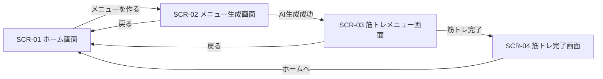

# Webアプリ仕様書

## 1. 概要

テキスト情報（具体的なものが望ましい）を入力として、LLMを用いて、
回答（これも具体的に指定）を表示するアプリ。

## 2. 主な機能

### 2.1 入出力フォーム機能
- テキストエリアでユーザーが質問・指示を入力
- 2.2 生成AIリクエストAPIを実行し、応答を取得する。
- 同一画面上に回答を表示する。

### 2.2 生成AIリクエスト API
- ユーザー入力と定型プロンプトを合成し、LLMに渡すコンテキストを生成
- その際に、適切なコンテキストを追加し、望ましい回答を得られるように情報を付加する。
- OpenRouter経由で各種LLM（例：GPT-4, Claude, Geminiなど）へリクエスト
- 応答をJSON形式でフロントエンドに返す。


## 3. 使用技術

| 分類         | 技術・ライブラリ |
|--------------|------------------|
| フロントエンド | Vue.js / HTML5 + CSS3 |
| バックエンド  | Flask |
| 通信方式     | Fetch API / JSON |
| LLMモデル    | OpenRouter API（OpenAI, Anthropic, Mistral等） |

## 4. 入出力例

### 入力
- ユーザー入力：「竹取物語」

- 付与コンテキスト：あなたは太宰治です。小難しい近代風のしゃべり方をします。

### 出力

- 出力例：月の光が眩しい。眩しすぎて、なんだか吐き気がする。老夫婦が見つけた竹の中から、あの憎らしいほど可愛らしい女の子が出てきたらしい。


# Webアプリ仕様書(小阪案)

## 1. システム名とキャッチコピー

### システム名

**duoMuscle**

### キャッチコピー

**ゲーム感覚で、筋トレを毎日の習慣に。**

---

## 2. ターゲットユーザー（ペルソナ）と解決したい課題（Why）

### ターゲットユーザー

筋トレを始めたい、または一度始めたことはあるが、継続することが苦手な大学生や若者を主なターゲットとする。

### 解決したい課題

筋トレは短期間では成果を実感しにくく、モチベーションを維持することが難しい。そのため、「今日はやらなくてもいい」「明日から再開しよう」と考えてしまい、三日坊主になってしまう人が多い。

そこで、duoMuscleでは、筋トレを単なる運動として管理するのではなく、XPや連続記録、レベルアップなどのゲーム要素を取り入れることで、筋トレを楽しく継続できる環境を提供する。

また、生成AIを利用して、その日の状況に応じたトレーニングメニューや励ましのメッセージを生成し、ユーザーが筋トレを続けやすくすることを目的とする。

---

## 3. As-Is（現状の課題）と To-Be（システム導入後の理想像）

### As-Is（現状）

* 筋トレを始めても、成果をすぐに実感できずモチベーションが低下する。
* 毎回どのようなトレーニングをすればよいか考える必要がある。
* 筋トレを行った記録や継続日数が分かりにくい。
* 一度筋トレを休むと、そのままやめてしまうことがある。
* 筋トレを「やらなければならないもの」と感じ、楽しみながら続けることが難しい。

### To-Be（導入後）

* 毎日の筋トレをゲーム感覚で楽しみながら行うことができる。
* ユーザーの希望に応じて生成AIがトレーニングメニューを提案してくれる。
* 筋トレを行うことでXPを獲得し、レベルアップによって成長を実感できる。
* 連続して筋トレを行った日数を確認でき、継続するモチベーションにつながる。
* 筋トレ終了後にAIから励ましのメッセージを受け取り、次のトレーニングへの意欲を高めることができる。

---

## 4. 主要な機能要件一覧

* ユーザーがその日に行う筋トレメニューを確認できること。
* ユーザーが鍛えたい部位や運動時間などを入力し、生成AIから筋トレメニューの提案を受けることができること。
* ユーザーが実施した筋トレを記録できること。
* 筋トレを完了することでXPを獲得し、レベルや成長状況を確認できること。
* 筋トレを継続した日数を記録し、ストリーク（連続記録）として確認できること。

---

## 5. 非機能要件

* ユーザーが操作してから、通常の画面処理は1秒以内、生成AIによる回答は10秒以内を目安に表示する。
* Google Chromeの最新版で正常に動作すること。
* PCのWebブラウザから利用できること。
* 初めて利用するユーザーでも直感的に操作できる、分かりやすい画面構成とすること。
* ユーザーが入力した内容に対してエラーが発生した場合は、エラーメッセージを表示すること。
* 生成AIとの通信に失敗した場合でも、アプリが停止せず再度操作できること。

# 6. 画面一覧・ワイヤーフレームと状態の定義

## 6.1 画面一覧

| 画面ID | 画面名 | 目的 |
|---|---|---|
| SCR-01 | ホーム画面 | 現在のレベル、XP、ストリーク、今日の筋トレ状況を確認する |
| SCR-02 | メニュー生成画面 | 鍛えたい部位と運動時間を入力し、生成AIに筋トレメニューを作成してもらう |
| SCR-03 | 筋トレメニュー画面 | 生成AIが作成した筋トレメニューを確認し、筋トレを実施する |
| SCR-04 | 筋トレ完了画面 | 筋トレ終了後の獲得XP、レベル、ストリーク、励ましメッセージを確認する |

---

## 6.2 SCR-01 ホーム画面

### 目的

ユーザーが現在の成長状況と、その日の筋トレ状況を確認する。

### 表示項目

- システム名「duoMuscle」
- 現在のレベル
- 現在のXP
- 次のレベルまでに必要なXP
- ストリーク（連続筋トレ日数）
- 今日の筋トレ状況
- 「筋トレメニューを作る」ボタン
- 今日の筋トレメニューが存在する場合は「今日のメニューを見る」ボタン

### ワイヤーフレーム

```text
+--------------------------------------+
|              duoMuscle               |
+--------------------------------------+

              LEVEL 3

            XP 240 / 300
       [██████████████------]

            5日連続！

+--------------------------------------+
| 今日のトレーニング                    |
|                                      |
| まだメニューがありません               |
|                                      |
|    [ 筋トレメニューを作る ]            |
+--------------------------------------+
```

### 状態定義

#### Idle（通常時）

- XP、レベル、ストリークを表示する。
- 今日の筋トレメニューが存在しない場合は「まだメニューがありません」と表示する。
- 今日の筋トレメニューが存在する場合は「今日のメニューを見る」ボタンを表示する。
- ユーザーは各ボタンを操作できる。

#### Loading（処理中）

- ユーザー状態をAPIから取得している間は「読み込み中...」と表示する。
- 二重操作を防止するため、操作ボタンを一時的に非活性にする。

#### Success（成功時）

- APIから取得した現在のXP、レベル、ストリークを表示する。
- 今日の筋トレメニューの有無を画面に反映する。

#### Error（異常時）

ユーザー状態の取得に失敗した場合は、以下のメッセージを表示する。

```text
情報を取得できませんでした。再度お試しください。
```

再度APIへアクセスできるように「再読み込み」ボタンを表示する。

---

## 6.3 SCR-02 メニュー生成画面

### 目的

ユーザーが鍛えたい部位と運動時間を入力し、生成AIから筋トレメニューの提案を受ける。

### 入力項目

| 項目 | 必須 | 内容 |
|---|---|---|
| 鍛えたい部位 | ○ | 胸、腕、背中、肩、腹筋、脚、全身から選択する |
| 運動時間 | ○ | 10分、20分、30分、45分、60分から選択する |

### ワイヤーフレーム

```text
+--------------------------------------+
|        AI筋トレメニュー作成            |
+--------------------------------------+

 鍛えたい部位 *

 [ 胸 ▼ ]


 運動時間 *

 [ 20分 ▼ ]


 [ 戻る ]    [ AIでメニューを作る ]
```

### 状態定義

#### Idle（通常時）

- ユーザーは鍛えたい部位と運動時間を選択できる。
- 必須項目が入力されている場合、生成ボタンを押すことができる。

#### Loading（処理中）

生成AIに問い合わせている間は、以下のメッセージを表示する。

```text
AIが筋トレメニューを考えています...
```

- 二重送信を防止するため、生成ボタンを非活性にする。
- 処理が完了するまで入力項目を変更できないようにする。

#### Success（成功時）

- 生成AIによる筋トレメニューの作成に成功した場合、SCR-03「筋トレメニュー画面」へ遷移する。
- 生成された筋トレメニューをSCR-03に表示する。

#### Error（異常時）

必須項目が入力されていない場合は、以下のメッセージを表示する。

```text
鍛えたい部位と運動時間を選択してください。
```

生成AIとの通信に失敗した場合は、以下のメッセージを表示する。

```text
筋トレメニューを生成できませんでした。
時間をおいて再度お試しください。
```

エラー発生後もアプリを停止させず、再度生成操作ができる状態に戻す。

---

## 6.4 SCR-03 筋トレメニュー画面

### 目的

生成AIによって作成された筋トレメニューの内容を確認し、筋トレ完了操作を行う。

### 表示項目

- メニュータイトル
- 対象部位
- 目安時間
- 種目名
- 回数または実施時間
- セット数
- 「筋トレ完了」ボタン
- 「戻る」ボタン

### ワイヤーフレーム

```text
+--------------------------------------+
|        今日の筋トレメニュー            |
+--------------------------------------+

 胸トレーニング
 目安時間：20分

 --------------------------------------

 1. プッシュアップ
    10回 × 3セット

 --------------------------------------

 2. ナロープッシュアップ
    8回 × 3セット

 --------------------------------------

 3. プランク
    30秒 × 3セット

 --------------------------------------

 [ 戻る ]          [ 筋トレ完了！ ]
```

### 状態定義

#### Idle（通常時）

- 生成済みの筋トレメニューを表示する。
- ユーザーは筋トレ内容を確認できる。
- 「筋トレ完了！」ボタンを押すことができる。

#### Loading（処理中）

「筋トレ完了！」ボタン押下後、以下のメッセージを表示する。

```text
記録しています...
```

- 二重登録を防止するため、完了ボタンを非活性にする。

#### Success（成功時）

- 筋トレ完了記録の登録に成功した場合、XP、レベル、ストリークを更新する。
- SCR-04「筋トレ完了画面」へ遷移する。

#### Error（異常時）

筋トレ完了記録の登録に失敗した場合は、以下のメッセージを表示する。

```text
筋トレ結果を記録できませんでした。
再度お試しください。
```

エラー発生後は、再度「筋トレ完了！」ボタンを押せる状態に戻す。

---

## 6.5 SCR-04 筋トレ完了画面

### 目的

筋トレを完了したユーザーに獲得XPやストリークなどの成果を表示し、次回のトレーニングへのモチベーションにつなげる。

### 表示項目

- 筋トレ完了メッセージ
- 獲得XP
- 現在XP
- 現在レベル
- レベルアップ結果
- ストリーク
- 励ましメッセージ
- 「ホームへ戻る」ボタン

### ワイヤーフレーム

```text
+--------------------------------------+
|         TRAINING COMPLETE!            |
+--------------------------------------+

              +50 XP

             LEVEL 4

           XP 20 / 400

            6日連続！


「今日もトレーニングお疲れさま！
 この調子で続けていきましょう！」


            [ ホームへ ]
```

### 状態定義

#### Idle（通常時）

- 完了画面を表示し、ユーザーが筋トレ結果を確認できる。
- 「ホームへ」ボタンを押すことができる。

#### Loading（処理中）

筋トレ完了結果を取得している場合は、以下のメッセージを表示する。

```text
結果を読み込み中...
```

#### Success（成功時）

以下の情報を表示する。

- 今回獲得したXP
- 更新後のXP
- 更新後のレベル
- ストリーク
- 励ましメッセージ

レベルアップした場合は、以下のように追加表示する。

```text
LEVEL UP!

LEVEL 3 → LEVEL 4
```

#### Error（異常時）

筋トレ完了結果の取得に失敗した場合は、以下のメッセージを表示する。

```text
結果を取得できませんでした。
```

エラーが発生した場合でも「ホームへ」ボタンを利用できるようにする。

---

# 7. 画面遷移

ユーザーの基本的な操作による画面遷移を以下に示す。



正常系では、

```text
ホーム画面
  ↓
メニュー生成画面
  ↓
筋トレメニュー画面
  ↓
筋トレ完了画面
  ↓
ホーム画面
```

の順に遷移する。

API通信や生成AIとの通信に失敗した場合は画面遷移を行わず、現在の画面上にエラーメッセージを表示する。

---

# 8. APIエンドポイント一覧

フロントエンドとバックエンド間の通信にはHTTPを使用し、データの送受信形式はJSONとする。

APIのURLはリソースを表す名詞を使用する。

JSONのキー名はcamelCaseで統一する。

APIのバージョンをURLに含め、`/api/v1/` を共通のパスとする。

| API ID | HTTP Method | Endpoint | 用途 |
|---|---|---|---|
| API-01 | GET | /api/v1/progress | XP、レベル、ストリークなど現在の成長状態を取得する |
| API-02 | POST | /api/v1/workout-plans | 生成AIを利用して新しい筋トレメニューを作成する |
| API-03 | GET | /api/v1/workout-plans/today | 当日の筋トレメニューを取得する |
| API-04 | POST | /api/v1/workout-records | 筋トレ完了記録を作成し、XP・レベル・ストリークを更新する |

---

